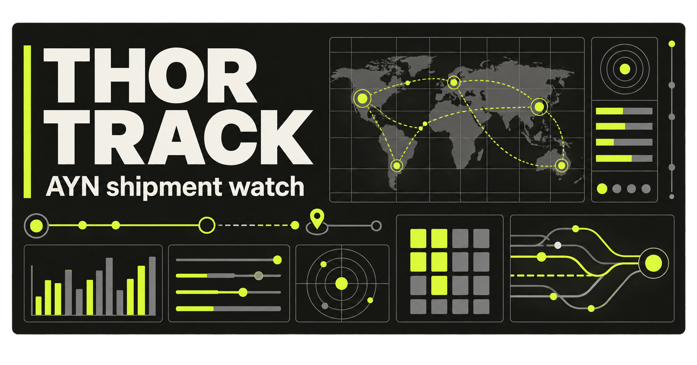

<div align="center">
  
  <h1>Thor Track</h1>
  <p><strong>A clear, mobile-friendly way to follow AYN Thor shipment ranges.</strong></p>
  <p>
    <a href="#how-it-works">How it works</a> ·
    <a href="#run-locally">Run locally</a> ·
    <a href="https://www.ayntec.com/pages/shipment-dashboard">Official AYN dashboard</a>
  </p>
</div>

Thor Track is an unofficial community utility that turns AYN's public shipment dashboard into a focused view of the Thor queue. Save an order prefix and exact configuration to see whether it has been listed, how far it is from the latest published range, and—when the data supports it—a cautious dispatch-window estimate.

## What you can do

- **Watch your place in the queue.** Enter an AYN order number, color, and model. Only the first four digits of the order number are retained.
- **Keep configurations separate.** Every color and model has its own queue, including separate Max 512GB and Max 1TB ranges.
- **Understand the result.** Thor Track distinguishes orders that are listed, still ahead of the frontier, not explicitly included in a posted range, or waiting on their first configuration update.
- **Explore shipment movement.** Compare the latest range for every configuration, inspect pace statistics, and browse the historical dispatch timeline.
- **Refresh with confidence.** The app checks AYN on load, every ten minutes while open, and when a stale tab becomes active again. A manual Refresh button always shows the outcome.
- **Use it comfortably anywhere.** The interface is responsive, keyboard-friendly, and includes a persistent light/dark theme toggle.

## How it works

1. Enter at least the first four digits of your AYN order number.
2. Choose the exact Thor color and model you ordered.
3. Select **Watch this order**.
4. Read the result, then use the trend chart and timeline for more context.

Your saved watch stays in that browser. There is no account, server-side watch list, background monitoring, or notification service. If browser storage is blocked, Thor Track keeps the watch for the current tab and tells you that it may not survive after the tab closes.

### Understanding watch statuses

| Status | What it means |
| --- | --- |
| **Listed by AYN** | The first four digits fall inside a range AYN published for the exact color and model. |
| **Watching** | The prefix is beyond that configuration's latest published endpoint. Thor Track shows the remaining prefix steps. |
| **Not explicitly listed** | AYN has published later prefixes for the configuration, but not a range containing this one. Thor Track does not guess across the gap. |
| **No range yet** | AYN has not published shipment data for that exact configuration. The watch remains saved. |

### About dispatch estimates

When an order is still ahead of the published frontier, Thor Track may show an inclusive seven-day **Estimated AYN dispatch window**. The estimate:

- uses only the selected color and model's history;
- follows the highest published endpoint over calendar time;
- requires recent, positive movement and enough history to support an estimate;
- is withheld when the source is stale, the queue is too sparse, or the projection is more than 90 days away; and
- includes a very low, low, or moderate confidence label.

This predicts when a prefix may appear on AYN's shipment dashboard. It is **not** an AYN promise, carrier tracking result, delivery confirmation, or delivery ETA.

## Data and privacy

- Shipment ranges come from the [official AYN shipment dashboard](https://www.ayntec.com/pages/shipment-dashboard).
- The app stores only the four-digit order prefix, chosen configuration, and theme preference in browser storage.
- The full order number is never retained or sent to the shipment endpoint, and the project has no user-account database.
- If a refresh fails, the interface marks live data as unavailable and keeps the last successfully loaded timeline. On an initial failure, it uses its clearly labeled bundled fallback.
- Plain **Max** on AYN's dashboard is treated as the **1TB** queue; **Max (512)** remains a separate 512GB queue.

## Run locally

### Requirements

- [Node.js](https://nodejs.org/) 22.13 or newer
- npm (included with Node.js)

### Setup

```bash
git clone https://github.com/RemyJP-Coding/ThorTracking.git
cd ThorTracking
npm ci
npm run dev
```

Open the local URL printed in the terminal.

No environment variables or external database are required for local development. The server route requests AYN's public feed at runtime; if that request fails, the app remains usable with its clearly labeled last-known data.

## Useful commands

| Command | Purpose |
| --- | --- |
| `npm run dev` | Start the local Vinext development server. |
| `npm test` | Run shipment forecasting, trend, storage, and API-route tests. |
| `npm run lint` | Check the TypeScript and React source with ESLint. |
| `npm run build` | Create a production build. |
| `npm start` | Serve the production build locally. |

## Troubleshooting

### My watch disappeared

Watches stay in the current browser profile. Private browsing, blocked site storage, cleared browser data, or another device will not have the saved watch. Allow site storage and save it again.

### Refresh says live data is unavailable

Check your connection, try **Refresh** again, and compare the result with AYN's official dashboard. Thor Track continues to show its last-known timeline and identifies that it could not load live data.

### No estimate is shown

This is often intentional. Thor Track withholds an estimate when the exact queue lacks enough recent movement, its data is stale or flat, or the projected prefix is too far away.

### The status is not what I expected

Confirm the first four digits, color, and model. Every configuration is evaluated separately, and the 512GB and 1TB Max queues are never combined.

## Project map

```text
app/
├── api/shipments/route.ts  # Same-origin bridge to AYN's public data
├── lib/shipments.ts        # Parsing, status, trend, and forecast logic
├── lib/watch-storage.ts    # Safe browser-local watch persistence
├── thor-tracker.tsx        # Main responsive tracker interface
├── globals.css             # Theme and presentation styles
└── layout.tsx              # Metadata and early theme setup
tests/                      # Node test suite
public/og.png               # Social and README artwork
```

The app uses React 19, Next.js 16 App Router conventions, TypeScript, Tailwind CSS 4, Vinext, Vite, OpenAI Sites tooling, and a Cloudflare-compatible runtime.

## Before opening a pull request

Run the complete local check:

```bash
npm test
npm run lint
npm run build
```

When changing shipment logic, keep color/model queues isolated and add a focused test for the new behavior. When changing the tracker UI, verify both a narrow phone layout and a desktop layout, including keyboard focus and light/dark themes.

---

Thor Track is an independent community project and is not affiliated with or endorsed by AYN. Always treat the official AYN dashboard and direct communication from AYN as the source of truth.
